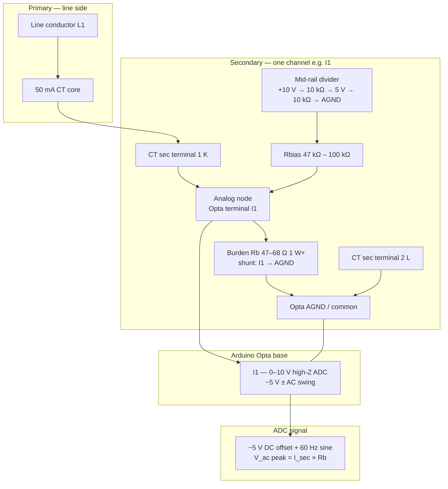
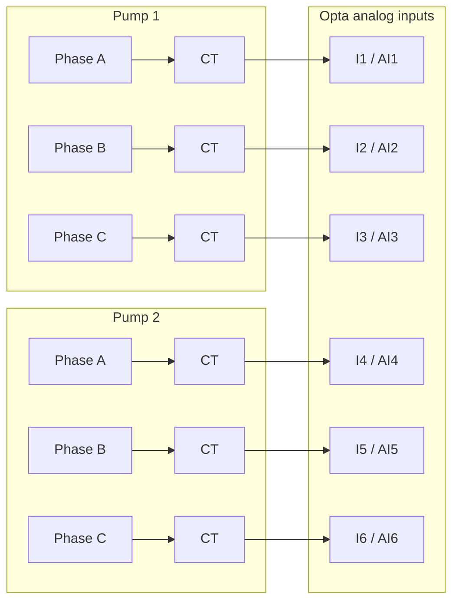
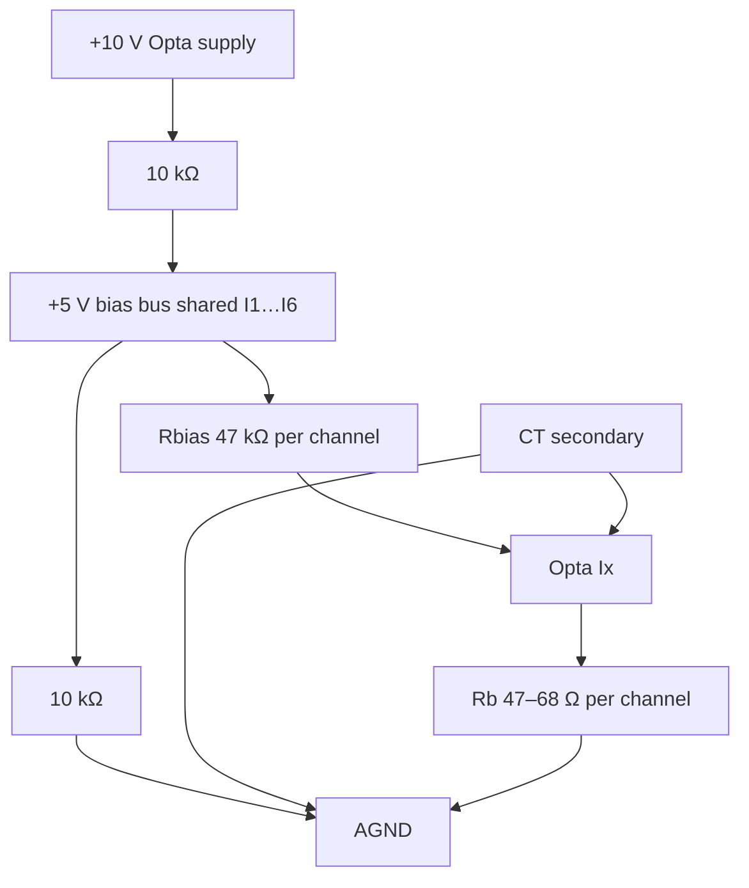
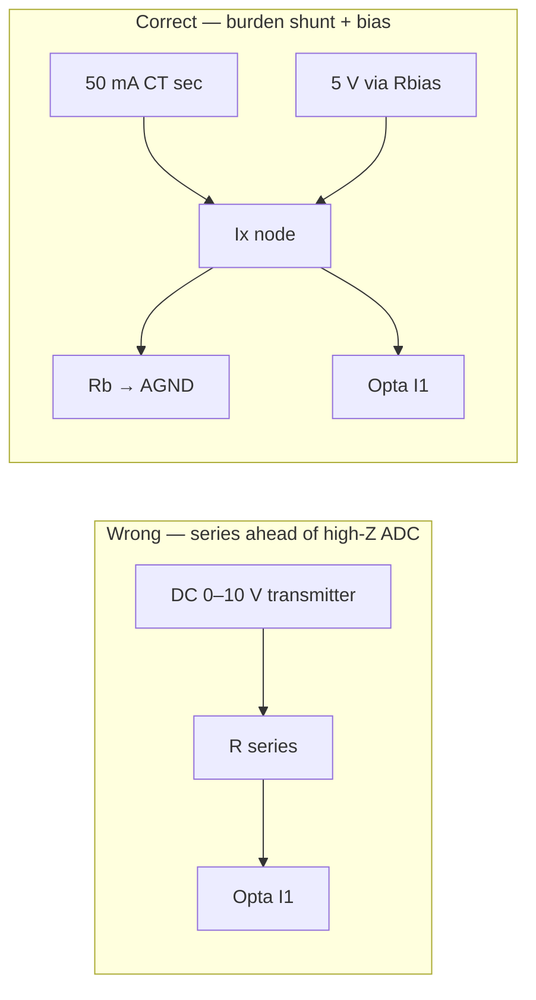
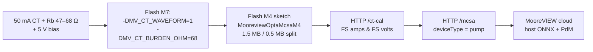

# Opta — 50 mA CT AC MCSA Wiring

**MooreVIEW integrator reference**  
**Applies to:** Arduino Opta MQTT ST firmware (`firmware/arduino-opta-mqtt-st/`)  
**Path:** True line MCSA — `-DMV_CT_WAVEFORM=1` + M4 coprocessor

---

## Purpose

This document shows how to wire **50 mA AC current transformers** to Opta base analog inputs **I1–I6** for **true AC waveform MCSA** (real 60 Hz FFT on the Cortex-M4 coprocessor), as opposed to:

| Input type | Opta sees | MCSA mode |
|------------|-----------|-----------|
| 0–1 V / 0–10 V **DC-RMS transmitter** | Steady DC ∝ RMS amps | Pseudo MCSA (`MV_CT_WAVEFORM=0`) |
| **50 mA CT + burden + mid-rail bias** | 60 Hz sine centered ~5 V | **True MCSA** (`MV_CT_WAVEFORM=1`) |

Firmware reference: `firmware/arduino-opta-mqtt-st/README.md` — *AC line MCSA* section.

---

## Single channel — AC waveform MCSA

One CT channel (example: Pump 1 phase A → **I1**):

### Reading the diagram

- CT secondary is a **current source**; the burden is the **load from I1 to AGND** (V = I × Rb).
- **Do not** place a resistor in **series** between a DC transmitter and I1 — Opta expects **voltage at the pin relative to AGND** (high-Z input).
- Mid-rail bias lifts the idle point to **~5 V** so the sine stays inside **0–10 V**.
- At **50 mA secondary × 68 Ω ≈ 3.4 V** peak → roughly **5 V ± 3.4 V** (1.6 V to 8.4 V) — OK.

---

## Duplex lift — six CT channels

Repeat the single-channel circuit for **I1 through I6**:

| Opta pin | Tag | Pump / phase |
|----------|-----|--------------|
| **I1** | AI1 | Pump 1 — phase A |
| **I2** | AI2 | Pump 1 — phase B |
| **I3** | AI3 | Pump 1 — phase C |
| **I4** | AI4 | Pump 2 — phase A |
| **I5** | AI5 | Pump 2 — phase B |
| **I6** | AI6 | Pump 2 — phase C |

Each channel: **CT sec → Ix node → Rb (Ix→AGND) → Rbias from 5 V bus → CT return → AGND**.

---

## Bias + burden detail

Shared **+5 V bias bus** can feed all six channels (one divider, six Rbias resistors):

---

## Wrong vs right — “shunt to GND, not series”

Firmware note (`mv_config.h`): *burden/shunt ohms from analog input to GND (not series)*.

---

## Burden resistor selection

| Goal | Burden | At 50 mA sec | Firmware |
|------|--------|--------------|----------|
| **AC waveform MCSA** | **47–68 Ω** | ~2.4–3.4 V peak AC | `-DMV_CT_WAVEFORM=1` |
| DC-RMS shunt (pseudo MCSA) | 180 Ω | ~9 V DC at FS | default `MV_CT_WAVEFORM=0` |
| DC-RMS shunt | 100 Ω | ~5 V DC at FS | `-DMV_CT_BURDEN_OHM=100` |
| DC-RMS shunt | 20 Ω | ~1 V DC at FS | default (same as 0–1 V TX) |

For AC MCSA use **47–68 Ω** so the biased sine does **not clip** at 0 V or 10 V.

**Do not** use AFX00007 **current** input mode with 50 mA (module max **25 mA**).

---

## Commissioning flow

### Pre-power checks

| Check | Expected |
|-------|----------|
| Motor **OFF**, DMM on I1 | **~5 V DC** (mid-rail) |
| Motor **RUN**, scope on I1 | **60 Hz sine** around 5 V |
| Peak voltage | **0.2 V – 9.8 V** (no clipping) |
| CT secondary | **Never open** while primary energized — burden always connected |

### Runtime telemetry

With AC path active, MQTT Parc `runtime` should show:

- `ctWaveform`: `"ac"`
- `mcsaLite`: `false` (after M4 ingest)
- `trueFft` / cooked `mcsa[]` with real fund / rotor / bearing bins

---

## Related docs

| Document | Topic |
|----------|-------|
| `firmware/arduino-opta-mqtt-st/README.md` | Dual-core MCSA, compile flags |
| `docs/AI_EDGE_CLOUD.md` | Pseudo vs true MCSA, host ONNX |
| `docs/projects/LIFT-STATION-EZMETER-PARC-CLOUD.md` | Duplex I1–I6 tag map (DC transmitter baseline) |
| `docs/projects/UNO-Q-EDGE-MOTOR-FAULT.md` | UNO Q true FFT alternative |

---

*Generate PDF: `npm run build:opta-ct-mcsa-wiring-pdf`*
